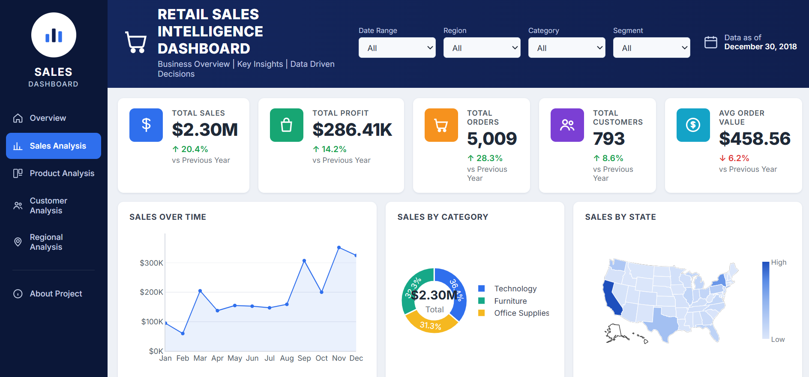
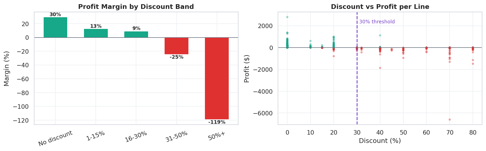
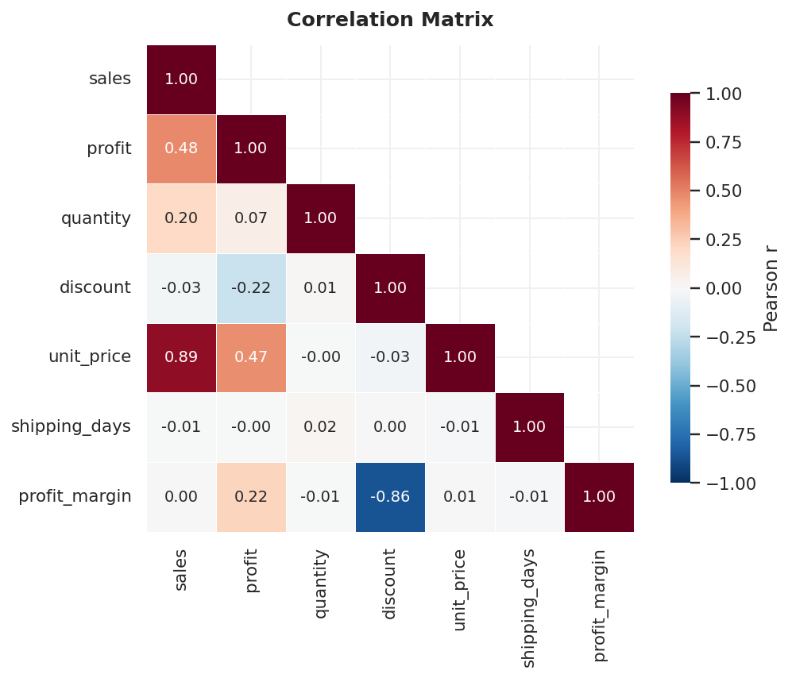
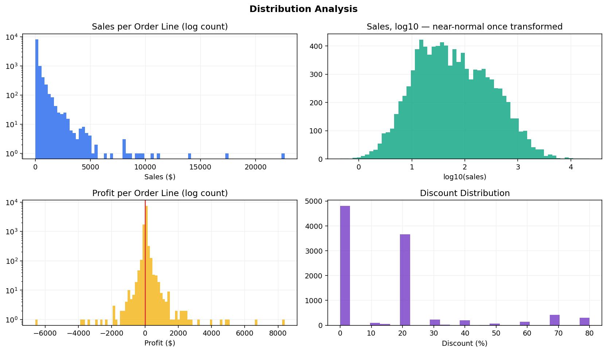
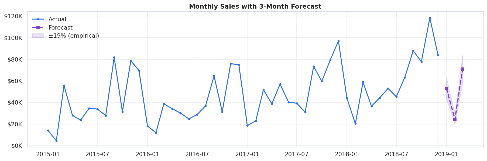

# Retail Sales Intelligence & Executive Decision Dashboard

End-to-end retail analytics on 9,993 transactions: raw extract → cleaned data → feature
engineering → SQL warehouse → statistical analysis → executive dashboard and recommendation.

**[View the live dashboard →](🌐 Live Dashboard:https://github.com/ayeshamumtaz1057/retail-sales-intelligence-dashboard )** ·
**[Executive deck (PDF) →](presentation/Retail_Insights.pdf)**



**Stack:** Python (pandas, NumPy, Matplotlib, seaborn) · SQL (SQLite) · Excel · Power BI ·
Plotly.js · Git

---

> ### Before you publish — 3 things to do
>
> 1. **Replace `YOUR-USERNAME`** — in this file, and in `presentation/CASE_STUDY.md`.
> 2. **Add the screenshots** — open `dashboard/web/index.html`, capture at 1920×1080, and
>    save as `images/dashboard.png`. The hero image above is broken until you do.
>    `presentation/CASE_STUDY.md` lists the full set.
> 3. **Add `dashboard/RetailDashboard.pbix`** — build it from `dashboard/POWERBI_GUIDE.md`,
>    or remove the Power BI references from this README.
>
> Delete this block once done.

---

## The business problem

A national retailer needs to know where its profit is going. Specifically:

- Which cities generate the highest revenue — and which of those actually earn?
- Which products sell well but return nothing?
- Which states consistently lose money?
- Does discounting reduce profit, and by how much?
- Which customer segments are worth retaining?
- Where should marketing spend go?

---

## The headline finding

**Discounting above 30% destroys $125,007 in profit — 44% of everything the business earns.**

| Discount band | Order lines | Sales | Profit | Margin |
|---|---:|---:|---:|---:|
| No discount | 4,798 | $1,087,908 | $320,988 | **+29.5%** |
| 1–15% | 146 | $81,928 | $10,448 | +12.8% |
| 16–30% | 3,883 | $867,540 | $79,980 | +9.2% |
| 31–50% | 310 | $195,315 | −$48,448 | **−24.8%** |
| 50%+ | 856 | $64,229 | −$76,559 | **−119.2%** |

Margin does not decline gradually — it holds through 30% and then collapses. Only **11.7%**
of order lines sit past that threshold.



### The finding nearly stayed hidden

The Pearson correlation between discount and profit is only **−0.22**, which reads as a weak
relationship and would justify dropping the thread.

But correlation measures *linear* association, and this is a **threshold effect**: nothing
much happens up to 30%, then margin falls off a cliff. A single coefficient averages the flat
part and the cliff together and reports "weak". Banding the data is what exposed it.



---

## Supporting findings

**Furniture is a third of revenue and almost none of the profit.**
32.3% of sales at a **2.5% margin**, against 17.4% for Technology and 17.0% for Office
Supplies. Tables lose $17,725 and Bookcases $3,473 — and Tables carry a 26% average discount,
the deepest in the catalogue.

**The geography of the problem is the same problem.**

| Region | Sales | Profit | Avg discount | Margin |
|---|---:|---:|---:|---:|
| West | $725,458 | $108,418 | 10.9% | **14.94%** |
| East | $678,500 | $91,535 | 14.5% | 13.49% |
| South | $391,722 | $46,749 | 14.7% | 11.93% |
| Central | $501,240 | $39,706 | **24.0%** | **7.92%** |

Ten states operate at a loss and **every one discounts between 28% and 40%**.

**Revenue rank hides the losses.** Philadelphia is the fifth-largest city by revenue
($109,077) and loses **$13,838**. Houston is sixth and loses $10,154. A revenue-only view of
the business ranks both as successes.

**Growth is real but recent.** Sales fell 2.8% in 2016, then grew 29.5% and 20.4%. Margin
improved every year, 10.2% → 12.7%.

**Customer value is concentrated, but not 80/20.** The top 20% produce **48%** of revenue —
real concentration, short of the rule usually assumed. A pure key-account strategy would leave
more than half the business unmanaged.

**Standard Class is the lowest-margin ship mode (12.1%)** and misses the 5-day SLA on 30.6% of
lines. First Class is both faster and higher-margin — suggesting cheap shipping attaches to
discount-heavy orders.

**Q4 carries the year.** November and December peak in all four years.

---

## Recommendations

| # | Action | Expected effect |
|---|---|---|
| 1 | Require approval for any discount above 30% | +44% to +51% profit |
| 2 | Reprice or discontinue Tables and Bookcases | Removes a $21K annual loss |
| 3 | Audit pricing authority in Central region | Closes a 7-point margin gap vs West |
| 4 | Review the 10 loss-making states and Philadelphia | Revenue rank is masking them |
| 5 | Weight inventory and campaign spend to Sep–Dec | Captures peak demand |

**Next step: a 90-day pilot of the 30% cap in Central, measured against the other regions.**
That converts an estimate into a decision.

---

## What the numbers cannot tell you

Stated up front, because they change how the recommendations should be read.

- **Correlation, not causation.** Deep discounts coincide with losses. The data cannot prove
  the discount *caused* the loss rather than both following from clearing slow stock. Hence a
  pilot rather than a rollout.
- **The cap simulation is an upper bound.** It assumes every sale still closes at the lower
  discount. Some customers would walk. Two methods bracket the answer: removing deep-discount
  lines entirely gives **+44%**; capping and keeping the sale gives **+51%**.
- **No COGS column.** Margin uses the supplied profit figure at face value.
- **The forecast has 18.8% backtest error.** Usable for direction, not for committing budget.
- **Superstore is a teaching dataset.** Realistic, but not a real company.

---

## Validated totals

Computed independently in **pandas**, **SQL**, and **live Excel formulas** — all three agree:

| Metric | Value |
|---|---:|
| Total sales | $2,296,919.49 |
| Total profit | $286,409.08 |
| Profit margin | 12.47% |
| Orders | 5,009 |
| Customers | 793 |
| Products | 1,862 |
| Avg order value | $458.56 |
| Period | 3 Jan 2015 – 30 Dec 2018 |

---

## Data quality

The raw extract has 10,800 rows and is not clean. Full audit in
[`outputs/data_quality_report.md`](outputs/data_quality_report.md).

| Issue | Rows | Resolution |
|---|---:|---|
| Shell rows — order ID present, all detail null | 806 | Dropped |
| Exact duplicate transactions | 504 | Dropped |
| Mixed date formats | all | Parsed with `format="mixed"` |
| Postal codes read as integers | all | Cast to text, zero-padded |
| Postal codes missing entirely | 11 | Documented, not invented — see below |
| Ship date before order date | 0 | Checked, none found |

**15 of 15 validation rules pass.** Result: **9,993 clean transactions**, matching the
canonical Superstore row count — and revenue totals are unchanged by the cleaning, because
every dropped row carried no sales value.

### The Burlington decision

All 11 missing postal codes are Burlington, Vermont. Vermont ZIPs begin with a zero (05401),
so it was stripped upstream and lost.

The pipeline imputes from the most common code for each city and state. Here that recovers
nothing, because every Burlington row is missing. The residual is **left null and documented**
rather than filled from an external source: `postal_code` is used in no analysis (state is the
geographic grain), and putting an untraceable value into a file labelled "cleaned" is worse
than an honest gap.

### Outliers are kept

2,851 rows (28.5%) fall outside IQR fences. They are not errors — the largest sale is a
$22,638 videoconferencing unit sold at 50% off, which **lost $1,811**. These are exactly the
transactions the analysis is about; removing them would delete the finding. Skew is handled
with log scales, not by dropping rows.



---

## Feature engineering

26 features across three groups. Full definitions in
[`outputs/feature_dictionary.md`](outputs/feature_dictionary.md).

| Group | Features |
|---|---|
| **Time** | `order_year`, `order_month`, `order_quarter`, `year_month`, `order_day_name`, `is_weekend_order`, `processing_month`, `shipping_days`, `is_delayed` |
| **Value** | `profit_margin`, `unit_price`, `is_loss`, `discount_value`, `discount_band`, `sales_category`, `margin_band` |
| **Customer** | `lifetime_orders`, `lifetime_value`, `avg_order_value`, `recency_days`, `is_repeat`, `is_high_value`, `rfm_score`, `rfm_segment` |

Two choices worth noting: `sales_category` bands are cut on **quartiles**, not fixed
thresholds, so they adapt to any extract; and `is_high_value` is the top **quintile** of
lifetime spend rather than a hardcoded dollar figure, so the flag stays meaningful as the
business grows.

### RFM segmentation

| Segment | Customers | % of revenue | Avg recency |
|---|---:|---:|---:|
| Champion | 124 (15.6%) | 28.2% | 28 days |
| Loyal | 254 (32.0%) | 42.8% | 75 days |
| Potential | 219 (27.6%) | 20.6% | 138 days |
| At Risk | 196 (24.7%) | 8.4% | 329 days |

At Risk is a quarter of the customer base and 8.4% of revenue — a large but individually
low-value win-back list, better suited to an automated sequence than to sales time.

---

## Database design

A star schema: one fact table at order-line grain, three conformed dimensions, six views.

```
dim_customer (793)  ─┐
dim_product (1,862) ─┼─→  fact_sales (9,993)  ─→  6 analytical views
dim_geography (632) ─┘
```

Two details that matter:

- **Grain is order-line, not order.** An `order_id` repeats across rows, so order counts must
  use `COUNT(DISTINCT order_id)`. Counting rows would overstate orders by 99%.
- **`dim_product` is deduplicated on `product_id`.** Superstore reuses a product ID across
  slightly different names; keeping the first per ID preserves referential integrity. The
  build asserts zero orphaned fact rows.

**Views** (`sql/views.sql`): `vw_monthly_summary`, `vw_customer_360`,
`vw_product_performance`, `vw_regional_summary`, `vw_discount_analysis`, `vw_sales_detail`.

---

## SQL queries

30 queries in [`sql/analysis_queries.sql`](sql/analysis_queries.sql), each answering one
business question. Results exported to `outputs/sql/`.

| # | Query | Technique |
|---|---|---|
| 01 | Executive KPIs | `COUNT(DISTINCT)` at order-line grain |
| 02 | Monthly revenue | `STRFTIME` grouping |
| 03 | Yearly growth | `LAG()` for YoY |
| 04 | Top 10 products by sales | join + aggregate |
| 05 | Worst products by profit | `HAVING SUM(profit) < 0` |
| 06 | Category performance | `SUM(SUM(x)) OVER ()` share of total |
| 07 | Sub-category performance | multi-level grouping |
| 08 | Top customers | `RANK()` |
| 09 | Customer segments | share-of-total window |
| 10 | Repeat customers | CTE + `CASE` bucketing |
| 11 | Region performance | multi-metric aggregate |
| 12 | State performance | feeds the choropleth |
| 13 | Daily sales pattern | weekday extraction |
| 14 | **Discount impact** | `CASE` banding — the key insight |
| 15 | Running total | `SUM() OVER (PARTITION BY … ORDER BY …)` |
| 16 | Top products by profit | view-backed |
| 17 | Bottom products by sales | delisting candidates |
| 18 | **High sales, low profit** | subquery on aggregates |
| 19 | Quarterly growth | `LAG()` on derived quarter key |
| 20 | Rolling 3-month sales | framed window `ROWS BETWEEN` |
| 21 | Customer lifetime value | `DENSE_RANK()` |
| 22 | RFM segments | segment rollup |
| 23 | High-value customers | tier comparison |
| 24 | Top cities by revenue | view-backed |
| 25 | Underperforming states | `HAVING` on aggregate |
| 26 | Shipping mode analysis | SLA breach rate |
| 27 | Highest discount orders | multi-key sort |
| 28 | Segment × category matrix | conditional aggregation cross-tab |
| 29 | Weekend vs weekday | boolean grouping |
| 30 | Product rank within category | `RANK() OVER (PARTITION BY …)` |

Covers `JOIN`, CTEs, window functions, `CASE WHEN`, `GROUP BY`, `HAVING`, and views.

---

## Notebooks

| Notebook | Contents |
|---|---|
| [`01_data_cleaning.ipynb`](notebooks/01_data_cleaning.ipynb) | Profiling, null-pattern diagnosis, type correction, validation |
| [`02_feature_engineering.ipynb`](notebooks/02_feature_engineering.ipynb) | 26 features, customer profile, RFM |
| [`03_eda.ipynb`](notebooks/03_eda.ipynb) | Distributions, outliers, correlation, the business questions |
| [`04_visualization.ipynb`](notebooks/04_visualization.ipynb) | Dashboard charts, forecast, discount simulation |

All four are committed **with outputs**, so GitHub renders them without anyone running code.

### Forecasting

Three-month projection using **seasonal naive with a linear trend** — each month predicted as
the same month last year, scaled by trailing YoY growth.

Chosen deliberately over ARIMA or Prophet: with 48 monthly observations and strong December
seasonality, a fitted model has too few complete cycles to learn from and tends to produce
confident, wrong intervals. A transparent baseline a business reader can verify by hand is
worth more — and it is the benchmark any sophisticated model would have to beat.

**Backtest on the last 6 months: MAPE 18.8%, MAE $15,325.** That error is the number to
quote, not the forecast itself.



---

## Repository structure

```
retail-sales-intelligence-dashboard/
├── data/
│   ├── raw/superstore_raw.csv              10,800 rows as received
│   ├── cleaned/superstore_clean.csv         9,993 rows, cleaning only
│   └── processed/
│       ├── superstore_features.csv          47 columns, 26 engineered
│       ├── customer_profile.csv             793 customers with RFM
│       ├── superstore.db                    SQLite star schema + views
│       └── agg_*.csv                        aggregates for Power BI
├── sql/
│   ├── schema.sql                           tables, indexes, constraints
│   ├── views.sql                            6 analytical views
│   └── analysis_queries.sql                 30 business queries
├── notebooks/
│   ├── 01_data_cleaning.ipynb
│   ├── 02_feature_engineering.ipynb
│   ├── 03_eda.ipynb
│   └── 04_visualization.ipynb
├── src/
│   ├── clean_data.py                        cleaning
│   ├── feature_engineering.py               26 features + RFM
│   ├── data_quality.py                      profiling, validation, outliers
│   ├── build_database.py                    → SQLite star schema
│   ├── run_sql_analysis.py                  runs all 30 queries
│   ├── make_notebooks.py                    builds + executes notebooks
│   ├── export_excel.py                      Excel workbook, live formulas
│   ├── build_web_dashboard.py               static dashboard
│   ├── make_presentation.js                 executive deck
│   └── templates/dashboard.html
├── excel/retail_sales_analysis.xlsx         6 sheets, 232 live formulas
├── dashboard/
│   ├── POWERBI_GUIDE.md                     DAX, what-if, drill-through, mobile
│   ├── RetailDashboard.pbix                 Power BI report
│   └── web/index.html                       deployable dashboard
├── presentation/
│   ├── Retail_Insights.pptx                 11-slide executive deck
│   ├── Retail_Insights.pdf
│   └── CASE_STUDY.md                        LinkedIn post + demo script
├── images/                                  21 generated charts
├── outputs/
│   ├── cleaning_report.txt
│   ├── data_quality_report.md
│   ├── feature_dictionary.md
│   ├── sql_results.md
│   └── sql/*.csv                            one file per query
├── docs/index.html                          GitHub Pages entry point
├── run_all.py                               full pipeline
├── requirements.txt
├── LICENSE
└── README.md
```

---

## Running it

```bash
git clone https://github.com/YOUR-USERNAME/retail-sales-intelligence-dashboard.git
cd retail-sales-intelligence-dashboard

python -m venv .venv
source .venv/bin/activate          # Windows: .venv\Scripts\activate
pip install -r requirements.txt

python run_all.py                  # 8 stages, ~30 seconds
```

Individual stages:

```bash
python src/clean_data.py            # → data/cleaned/
python src/feature_engineering.py   # → data/processed/
python src/data_quality.py          # → outputs/data_quality_report.md
python src/build_database.py        # → superstore.db + 6 views
python src/run_sql_analysis.py      # → outputs/sql/
python src/make_notebooks.py        # → notebooks/ + images/
python src/export_excel.py          # → excel/
python src/build_web_dashboard.py   # → dashboard/web/

node src/make_presentation.js       # → presentation/ (needs pptxgenjs)
```

---

## Deploying the dashboard

`docs/` is already set up for GitHub Pages:

```bash
git add . && git commit -m "Retail sales intelligence dashboard" && git push
```

Then **Settings → Pages → Source: `main` / `/docs`**. Live in about a minute.

Alternatives: drag `dashboard/web/` onto [Netlify Drop](https://app.netlify.com/drop), or
`cd dashboard/web && vercel --prod`.

For Power BI, see [`dashboard/POWERBI_GUIDE.md`](dashboard/POWERBI_GUIDE.md) — it covers the
DAX measures, the what-if discount simulator, drill-through pages, tooltip pages, bookmarks,
and mobile layout.

---

## Data source

Sample Superstore, a standard retail analytics teaching dataset (9,994 US transactions,
2015–2018). Distributed with Tableau and widely mirrored.

## Licence

MIT
