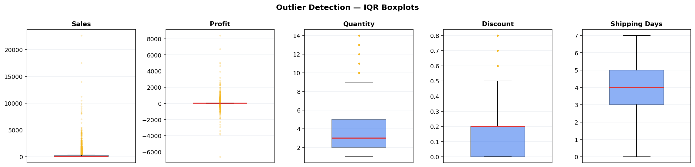

# Data Quality Report

Raw extract: **10,800 rows x 21 columns**  
Processed:  **9,993 rows x 47 columns**  
Validation: **15/15 rules passed**

---

## 1. Raw data profile

Columns with missing values in the raw extract:

|               | dtype   |   null_count |   null_pct |   unique |
|:--------------|:--------|-------------:|-----------:|---------:|
| Order Date    | str     |          806 |       7.46 |     1236 |
| Ship Date     | str     |          806 |       7.46 |     1334 |
| Ship Mode     | str     |          806 |       7.46 |        4 |
| Customer ID   | str     |          806 |       7.46 |      793 |
| Customer Name | str     |          806 |       7.46 |      793 |
| Segment       | str     |          806 |       7.46 |        3 |
| Country       | str     |          806 |       7.46 |        1 |
| City          | str     |          806 |       7.46 |      531 |
| State         | str     |          806 |       7.46 |       49 |
| Postal Code   | float64 |          817 |       7.56 |      630 |
| Region        | str     |          806 |       7.46 |        4 |
| Product ID    | str     |          806 |       7.46 |     1862 |
| Category      | str     |          806 |       7.46 |        3 |
| Sub-Category  | str     |          806 |       7.46 |       17 |
| Product Name  | str     |          806 |       7.46 |     1850 |
| Sales         | float64 |          806 |       7.46 |     5825 |
| Quantity      | float64 |          806 |       7.46 |       14 |
| Discount      | float64 |          806 |       7.46 |       12 |
| Profit        | float64 |          806 |       7.46 |     7287 |

All 19 affected columns share the same 817 missing rows, which is the signature of empty shell records rather than scattered data entry gaps.

---

## 2. Validation rules

Each rule is a business constraint the data must satisfy after cleaning.

| rule                                      |   violations | status   |
|:------------------------------------------|-------------:|:---------|
| No null order IDs                         |            0 | PASS     |
| No null customer IDs                      |            0 | PASS     |
| No null sales values                      |            0 | PASS     |
| No duplicate transactions                 |            0 | PASS     |
| Sales are non-negative                    |            0 | PASS     |
| Quantity is positive                      |            0 | PASS     |
| Discount within 0-100%                    |            0 | PASS     |
| Ship date on or after order date          |            0 | PASS     |
| Shipping days within 0-30                 |            0 | PASS     |
| Country is single-valued (US)             |            0 | PASS     |
| Region in expected set                    |            0 | PASS     |
| Segment in expected set                   |            0 | PASS     |
| Category in expected set                  |            0 | PASS     |
| Postal code is 5 chars or explicitly null |            0 | PASS     |
| Profit margin is finite                   |            0 | PASS     |

---

## 3. Outlier detection

IQR fences (1.5 x IQR beyond the quartiles) and a 3-sigma z-score, reported side by side. Sales and profit are heavily right-skewed, so the IQR count is the more reliable of the two.

| column        |      min |    q1 |   median |     q3 |      max |   iqr_lower |   iqr_upper |   iqr_outliers |   iqr_pct |   zscore_outliers |   skew |
|:--------------|---------:|------:|---------:|-------:|---------:|------------:|------------:|---------------:|----------:|------------------:|-------:|
| sales         |     0.44 | 17.28 |    54.48 | 209.94 | 22638.5  |     -271.71 |      498.93 |           1167 |     11.68 |               127 |  12.97 |
| profit        | -6599.98 |  1.73 |     8.67 |  29.36 |  8399.98 |      -39.72 |       70.81 |           1881 |     18.82 |               107 |   7.56 |
| quantity      |     1    |  2    |     3    |   5    |    14    |       -2.5  |        9.5  |            170 |      1.7  |               113 |   1.28 |
| discount      |     0    |  0    |     0.2  |   0.2  |     0.8  |       -0.3  |        0.5  |            856 |      8.57 |               300 |   1.68 |
| shipping_days |     0    |  3    |     4    |   5    |     7    |        0    |        8    |              0 |      0    |                 0 |  -0.42 |

**2,851 rows** (28.5%) are flagged on at least one measure. Full list in `outputs/outliers.csv`.

### Decision: outliers are kept

They are not errors. The largest sale is a $22,638 copier order, and the largest loss is $-6,600 on a heavily discounted machine. Both are genuine transactions, and the loss-making ones are precisely what the analysis is about. Removing them would delete the finding.

Where a skewed distribution would distort a chart, a log scale is used instead of dropping rows.

---

## 4. Cleaning actions applied

| Issue | Rows | Action |
|---|---:|---|
| Shell rows (order ID present, all detail null) | 806 | Dropped |
| Exact duplicate transactions | 504 | Dropped |
| Mixed date formats | all | Parsed with `format='mixed'` |
| Postal codes read as integers | all | Cast to text, zero-padded to 5 |
| Stray whitespace in text columns | all | Trimmed |

Result: **9,993 clean transactions**, matching the canonical Superstore row count.